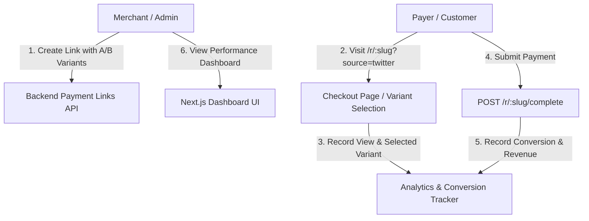

# Payment Link Analytics, Conversion Tracking & A/B Testing Guide

This document details the design, architecture, API endpoints, A/B testing mechanism, conversion tracking metrics, QR code generation, and link sharing tools for AgenticPay Payment Links.

---

## 1. Overview

AgenticPay Payment Links allow merchants to accept non-custodial cryptographic payments and fiat-equivalent checkouts through shareable links, embedded widgets, and QR codes.

### Key Capabilities

1. **Payment Link Analytics**: Real-time tracking of impressions/views, payment completions, conversion rates (`(completions / views) * 100`), total revenue generated, and traffic source attribution (`direct`, `newsletter`, `twitter`, `facebook`, `linkedin`, `email`).
2. **Conversion Tracking**: Granular tracking of individual conversion events, recording transaction amounts, timestamps, assigned variant IDs, traffic sources, referrers, and user agents.
3. **A/B Testing for Link Variants**: Dynamic traffic distribution between link variants with customized prices/amounts, descriptions, brand accent colors, CTA labels, and configurable traffic split weights (e.g. 50/50, 70/30).
4. **Merchant Performance Dashboard**: Aggregated summary metrics for merchants including total payment links, active links, total views, total completions, total revenue, overall conversion rate, and top-performing links.
5. **QR Code Generation**: On-demand SVG and PNG Data URI QR code generation for physical point-of-sale displays, print marketing, and mobile scanning.
6. **Link Sharing Tools**: Automatic generation of social sharing URLs (Twitter/X, WhatsApp, LinkedIn, Telegram, Email), custom UTM source parameter appending, and responsive HTML `<iframe` embed snippets.

---

## 2. Architecture & Data Flow



---

## 3. REST API Reference

### 3.1 Create Payment Link

**`POST /api/payment-links`**

Creates a new payment link with optional password protection, usage cap, and A/B test variants.

**Request Body:**

```json
{
  "merchantId": "m_12345",
  "amount": 100.00,
  "currency": "USD",
  "description": "Monthly Retainer",
  "expiresAt": "2026-12-31T23:59:59.000Z",
  "recurrence": "monthly",
  "tags": ["services", "retainer"],
  "category": "services",
  "variants": [
    { "id": "var_a", "name": "Standard Price", "amount": 100.00, "weight": 50 },
    { "id": "var_b", "name": "Early Bird Promo", "amount": 90.00, "weight": 50, "ctaText": "Claim Discount" }
  ]
}
```

**Response (201 Created):**

```json
{
  "data": {
    "id": "pl_8f29...",
    "merchantId": "m_12345",
    "slug": "k3f91a7c8b2e4d",
    "amount": 100,
    "currency": "USD",
    "isActive": true,
    "analytics": {
      "views": 0,
      "completions": 0,
      "totalRevenue": 0,
      "conversionRate": 0,
      "bySource": {},
      "variantAnalytics": {
        "var_a": { "variantId": "var_a", "name": "Standard Price", "views": 0, "completions": 0, "totalRevenue": 0, "conversionRate": 0 },
        "var_b": { "variantId": "var_b", "name": "Early Bird Promo", "views": 0, "completions": 0, "totalRevenue": 0, "conversionRate": 0 }
      }
    }
  },
  "qrCodeUrl": "https://api.qrserver.com/v1/create-qr-code/?size=300x300&data=...",
  "share": {
    "url": "https://pay.agenticpay.com/r/k3f91a7c8b2e4d",
    "twitter": "https://twitter.com/intent/tweet?...",
    "embedCode": "<iframe src=\"https://pay.agenticpay.com/r/k3f91a7c8b2e4d\"... font-weight=\"bold\"></iframe>"
  }
}
```

---

### 3.2 Configure A/B Testing Variants

**`POST /api/payment-links/id/:id/variants`**

Adds or updates the A/B testing variants for an existing payment link.

**Request Body:**

```json
{
  "variants": [
    { "id": "var_a", "name": "Control Variant ($100)", "amount": 100.00, "weight": 50 },
    { "id": "var_b", "name": "Promo Variant ($85)", "amount": 85.00, "weight": 50, "ctaText": "Get 15% Off" }
  ]
}
```

---

### 3.3 Fetch Detailed Analytics & Conversion Logs

**`GET /api/payment-links/id/:id/analytics`**

Returns overall conversion metrics, traffic source breakdown, per-variant A/B performance metrics, and individual conversion history logs.

**Response:**

```json
{
  "data": {
    "views": 150,
    "completions": 45,
    "totalRevenue": 4050.00,
    "conversionRate": 30.00,
    "bySource": {
      "direct": 60,
      "twitter": 50,
      "newsletter": 40
    },
    "variantAnalytics": {
      "var_a": { "variantId": "var_a", "name": "Control Variant ($100)", "views": 75, "completions": 20, "totalRevenue": 2000.00, "conversionRate": 26.67 },
      "var_b": { "variantId": "var_b", "name": "Promo Variant ($85)", "views": 75, "completions": 25, "totalRevenue": 2125.00, "conversionRate": 33.33 }
    },
    "conversions": [
      {
        "id": "conv_991",
        "linkId": "pl_8f29...",
        "slug": "k3f91a7c8b2e4d",
        "variantId": "var_b",
        "amount": 85,
        "currency": "USD",
        "source": "twitter",
        "timestamp": "2026-07-29T22:30:00.000Z"
      }
    ]
  }
}
```

---

### 3.4 Merchant Dashboard Performance Summary

**`GET /api/payment-links/merchant/:merchantId/summary`**

Returns aggregated KPI metrics across all payment links owned by a merchant.

**Response:**

```json
{
  "data": {
    "merchantId": "m_12345",
    "totalLinks": 12,
    "activeLinks": 10,
    "totalViews": 1420,
    "totalCompletions": 412,
    "totalRevenue": 38450.00,
    "overallConversionRate": 29.01,
    "topLinks": [
      {
        "id": "pl_8f29...",
        "slug": "starter-retainer",
        "views": 500,
        "completions": 180,
        "conversionRate": 36.00,
        "totalRevenue": 18000.00
      }
    ]
  }
}
```

---

### 3.5 QR Code Generation Endpoint

**`GET /api/payment-links/id/:id/qr?type=data-url|svg`**

Returns high-resolution QR code image for a payment link.

- Query `type=data-url`: Returns JSON `{ dataUrl: "data:image/png;base64,...", linkUrl: "..." }`.
- Query `type=svg`: Returns raw `image/svg+xml` content.

---

### 3.6 Link Sharing Tools Endpoint

**`GET /api/payment-links/id/:id/share-links?variant=var_b&source=newsletter`**

Generates formatted share URLs and embed code with custom campaign parameters.

---

## 4. Frontend Integration & Performance Dashboard

The frontend dashboard is located at:
[frontend/app/[locale]/dashboard/payments/links/page.tsx](file:///c:/Users/Ososanwo/Idris/Documents/agenticpay/frontend/app/%5Blocale%5D/dashboard/payments/links/page.tsx)

Key components:
- **`PaymentLinkSummaryCards`**: Renders high-level KPI cards for Total Links, Total Views, Conversions, Conversion Rate %, and Total Revenue.
- **`PaymentLinkAnalyticsModal`**: Interactive modal displaying conversion rates, revenue metrics, traffic source breakdown, and per-variant A/B comparison.
- **`ABTestConfigModal`**: Form modal for creating/modifying price points, CTA text, and traffic split ratios.
- **`LinkShareModal`**: Multi-tab modal providing UTM campaign links, SVG QR code download, social shortcuts, and HTML embed snippets.

---

## 5. Testing & Verification

Run the automated Vitest test suite for Payment Links analytics & routes:

```bash
npx turbo run test --filter=agenticpay-backend
```
